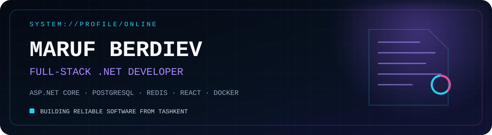

  

  
  
  

 

<table>
  <tr>
    <td width="55%" valign="top">
      <h3>System.info</h3>
      <pre><code>name       = "Maruf Berdiev"
role       = "Full-stack .NET Developer"
company    = "Ministry of Sports of Uzbekistan"
location   = "Tashkent, Uzbekistan"
focus      = ["Backend", "Distributed systems",
              "Product engineering"]
currently  = "Building reliable public-sector systems"
principle  = "Simple outside. Deep inside."</code></pre>
    </td>
    <td width="45%" valign="top">
      
    </td>
  </tr>
</table>

## Core stack

  

## What I build

- Production-ready APIs with ASP.NET Core, PostgreSQL and Redis.
- Full-stack web products with React and modern CI/CD workflows.
- Maintainable systems with clear domain boundaries and pragmatic architecture.
- Public-sector and education platforms that combine reliable workflows, reporting and operational tooling.

## Selected work

<table>
  <tr>
    <td width="50%" valign="top">
      <h3>Algoritm School Platform</h3>
      
School operations, online testing, LMS, parent monitoring, admissions and reporting in one product.

      
<code>ASP.NET Core</code> <code>React</code> <code>PostgreSQL</code> <code>Redis</code> <code>MinIO</code> <code>Docker</code>

    </td>
    <td width="50%" valign="top">
      <h3>Backend engineering</h3>
      
Secure APIs, background processing, integrations, database optimization and automated deployment.

      
<code>.NET</code> <code>Hangfire</code> <code>PostgreSQL</code> <code>CI/CD</code> <code>Nginx</code>

    </td>
  </tr>
</table>

## GitHub telemetry

  
  

  

<picture>
  <source media="(prefers-color-scheme: dark)" srcset="https://raw.githubusercontent.com/fuga002/fuga002/output/github-contribution-grid-snake-dark.svg" />
  <source media="(prefers-color-scheme: light)" srcset="https://raw.githubusercontent.com/fuga002/fuga002/output/github-contribution-grid-snake.svg" />
  
</picture>

  Open to meaningful engineering conversations and product collaboration.

